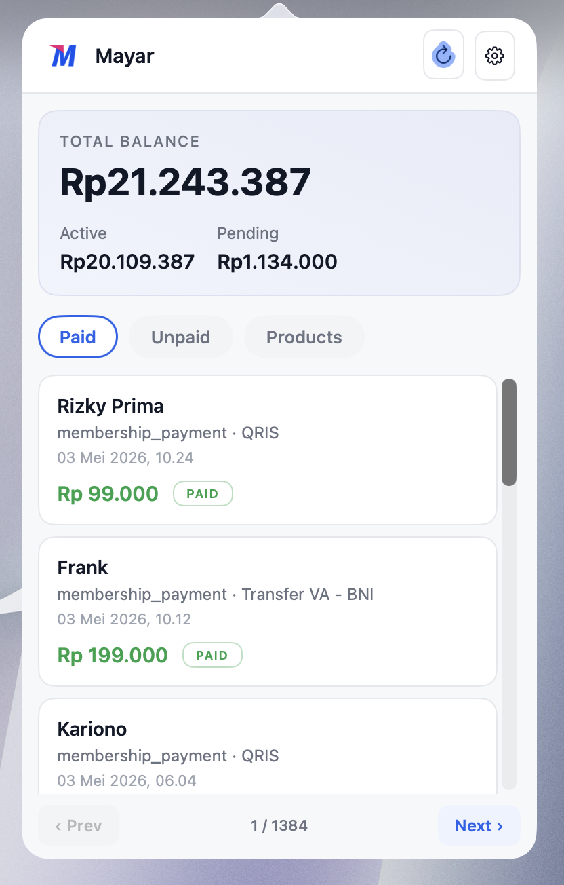

# Mayar Menu Bar

A small native macOS menu-bar app that shows your [Mayar](https://mayar.id) balance and recent activity at a glance. Click any row to see full transaction or product details, copy IDs and checkout links, or open payment URLs.

[](https://github.com/moerdowo/mayar-mac-menubar/releases/latest)


[](https://github.com/moerdowo/homebrew-mayar)

<p align="center">
  
</p>

## Features

- **At-a-glance balance** in the menu bar — total in the bar, with Active / Pending breakdown one click away.
- **Three tabs** for Paid transactions, Unpaid invoices, and Products — each independently paginated against the Mayar Headless API.
- **Detail views** — click any row for full transaction or product info with copy buttons for IDs, public links, and checkout URLs.
- **Skeleton loading** on first load and on every refresh / page change, so you always know when data is being fetched.
- **Light, Dark, or System** appearance — the menu-bar icon also adapts via macOS template tinting.
- **Hide Balance** toggle so the amount isn't visible to over-the-shoulder onlookers.
- **Launch at Login** via `SMAppService` — the app starts when you log in.
- **Signed & notarized** with an Apple Developer ID — installs cleanly via Homebrew or DMG, no Gatekeeper warnings.
- Native AppKit. No Electron, no bundled runtime — about 1k lines of Swift.

## Install

### Homebrew (recommended)

```sh
brew tap moerdowo/mayar
brew install --cask mayar-menubar
```

That installs `MayarMenuBar.app` into `/Applications`. Launch it from Finder or via `open -a MayarMenuBar`. The build is signed with a Developer ID Application certificate and notarized by Apple, so Gatekeeper accepts it on first launch with no prompts.

### Manual (DMG)

Download the latest DMG from [Releases](https://github.com/moerdowo/mayar-mac-menubar/releases/latest), open it, drag `MayarMenuBar.app` into `/Applications`, then launch.

## Setup

On first launch the app prompts for your **Mayar API key** (bearer token):

1. Visit <https://web.mayar.id/api-keys>.
2. Create a new key.
3. Paste it into the prompt and click **Save**.

The key is stored at `~/Library/Application Support/MayarMenuBar/config.json` with `0600` permissions. You can update it later from the gear (Settings) menu in the popover.

## Settings

Click the gear icon in the popover header — or right-click the menu-bar icon — for:

| Item | What it does |
|---|---|
| Set API Key… | Update the bearer token |
| Hide Balance in Menu Bar | Show only the icon, no amount |
| Appearance | Light (default) / Dark / System |
| Launch at Login | Start with macOS |
| Open Dashboard | Opens <https://web.mayar.id> |
| Quit | Exit the app |

## Build from source

Requires macOS 13+ and the Swift toolchain (Command Line Tools or Xcode).

```sh
git clone https://github.com/moerdowo/mayar-mac-menubar
cd mayar-mac-menubar

# Compile + bundle into a runnable .app at build/MayarMenuBar.app
bash scripts/build-app.sh

# Optional: wrap as a drag-installable DMG at build/MayarMenuBar-<ver>.dmg
bash scripts/build-dmg.sh
```

Build is plain SwiftPM (`swift build -c release`) plus a small `hdiutil`-based DMG step. No Xcode project required.

## Architecture

- AppKit, written in Swift, in `Sources/MayarMenuBar/`.
- `NSStatusItem` with a custom transient `NSPopover` for the dropdown UI.
- `URLSession` async/await for the API client; `Codable` models for responses.
- Layer-backed custom views (`RoundedView`, `Pill`, `IconButton`, `TabButton`, `SoftButton`, `SkeletonView`) that override `updateLayer()` so they recolor automatically when the effective appearance changes.
- `SMAppService.mainApp` for Launch at Login.
- Config persisted as JSON at `~/Library/Application Support/MayarMenuBar/config.json`.
- Production-only — Mayar's sandbox is no longer wired up.

API endpoints used: `GET /hl/v1/balance`, `GET /hl/v1/transactions`, `GET /hl/v1/transactions/unpaid`, `GET /hl/v1/product`. Full reference: [`docs/mayar-api.md`](docs/mayar-api.md).

## Privacy

The app talks only to `api.mayar.id`. No analytics, no telemetry, no third parties. The API key is stored locally and only ever leaves your machine inside the `Authorization: Bearer …` header on each Mayar API call.

## License

Not yet licensed. If you want to redistribute or fork, please open an issue first.
